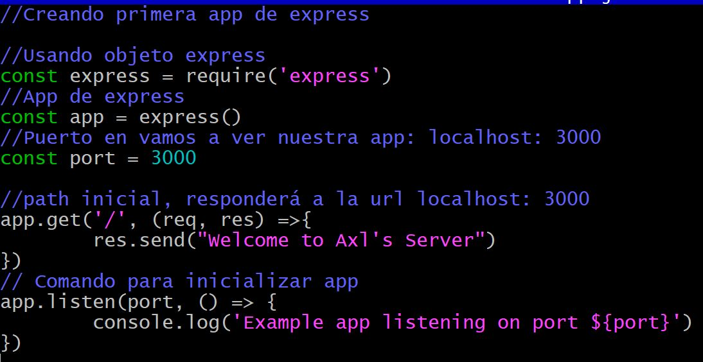

# Mi primer server con Express.js  👨‍💻

## Backend project developed during the Microsoft Launch X training

### ⚜ Procedimiento:

Para iniciar un proyecto js es necesario ingresar el comando `npm init` el cual creara
de forma automática el archivo package.json

Despues hay que instalas la dependencia de express con el comando `npm install express --save`
Y crear un archivo principal para nuestra app.

`app.js`


para ejecutar la aplicación hay que ejecutar el comando `node app.js` y a continuación
entrar desde tu navegador a `localhost:3000`


Hemos levantado un servidor de Node JS. 🤪

## Agregando una nueva ruta

Podemos agregar rutas nuevas con el comando

```
app.get('/explorersInNode', (req,res) =>{
   const explorer = {name: "Explorer", msg: "Hello"}
   res.send(explorer)
})

```
Ademas, estamos creando un objeto y regresandolo.


### Mis redes sociales

### No olvides visitar mi Blog


