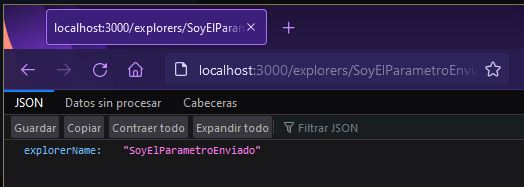

# Mi primer server con Express.js  👨‍💻

## Backend project developed during the Microsoft Launch X training

### ⚜ Procedimiento:

Para iniciar un proyecto js es necesario ingresar el comando `npm init` el cual creara
de forma automática el archivo package.json

Despues hay que instalas la dependencia de express con el comando `npm install express --save`
Y crear un archivo principal para nuestra app.

`app.js`


para ejecutar la aplicación hay que ejecutar el comando `node app.js` y a continuación
entrar desde tu navegador a `localhost:3000`


Hemos levantado un servidor de Node JS. 🤪

## Agregando una nueva ruta

Podemos agregar rutas nuevas con el comando

```
app.get('/explorersInNode', (req,res) =>{
   const explorer = {name: "Explorer", msg: "Hello"}
   res.send(explorer)
})

```
Ademas, estamos creando un objeto y regresandolo.

Para ver el resultado es necesario ingresar al navegador con la siguiente ruta 

`localhost:3000/explorersInNode`


## Agregando una nueva ruta que reciba Query Params

Para lograr enviar un parametro enviado por la URL hay que agregar lo siguiente:

```
app.get('/explorers/:explorerName'), (req,res) =>{
   res.send(req.params)
})

```

con la nueva ruta añadida el objeto `req` contiene la propiedad `params`, la cual contiene
los `Query Paramas` que son los paámetros enviados por la url (req.params)

Hay que entrar  a la url `/explorers/SoyElParámetroEnviado`




### Mis redes sociales

[Instagram](https://www.instagram.com/axlze/)

[GitHub](https://github.com/axlgoze/)

[LinkedIn](https://www.linkedin.com/in/axl-reyes-b6914b219/)

### No olvides visitar mi Blog

[El BLog de Axl Reyes](https://axlgoze.github.io/my_launchx_blog/)
